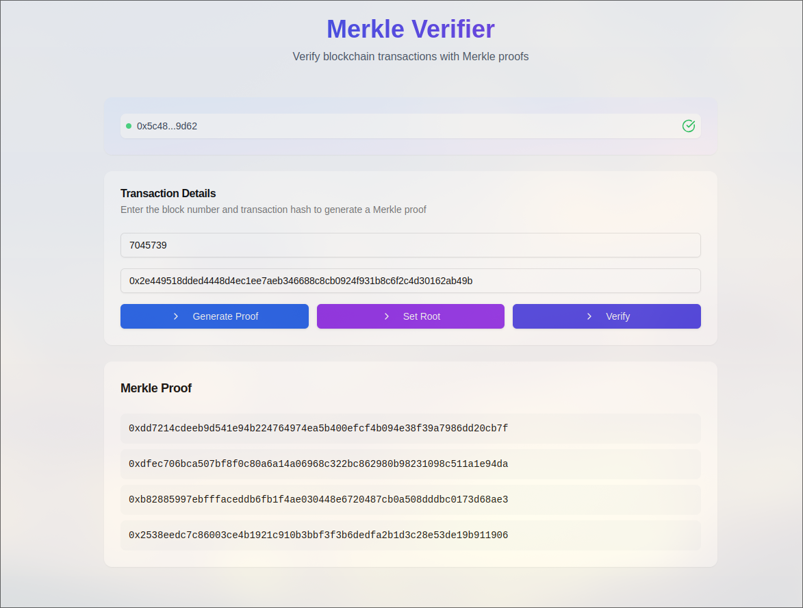
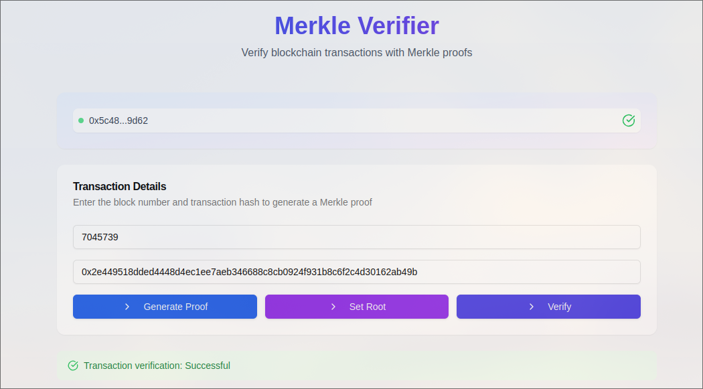

# Merkle Verifier dApp

https://merkleverifier-o0kk8vpd8-rustichouse042gmailcoms-projects.vercel.app/

A decentralized application for verifying transaction inclusion in Ethereum blocks using Merkle proofs. This project includes a smart contract deployed on Sepolia testnet and a Next.js frontend interface.

## Features

- 🔗 Connect to MetaMask wallet
- 📦 Generate Merkle proofs for transactions in a specific block
- ✅ Verify transaction inclusion using Merkle proofs
- 🌲 Set Merkle root for block transactions

## Prerequisites

- Node.js (v16 or later)
- npm or yarn
- MetaMask browser extension
- Sepolia testnet ETH for contract interaction

## Technology Stack

- **Frontend**: Next.js 13+ (App Router)
- **Smart Contract**: Solidity ^0.8.0
- **Development Environment**: Hardhat
- **Ethereum Interaction**: ethers.js v5
- **Merkle Tree Implementation**: merkletreejs

## Installation

1. Clone the repository:
```bash
git clone https://github.com/ayushh2k/merkle-verifier
cd merkle-verifier
```

2. Install dependencies:
```bash
npm install
```
```bash
cd frontend
npm install
```

3. Create a `.env` file in root directory with the following variables:
```env
INFURA_PROJECT_ID=YourInfuraProjectId
PRIVATE_KEY=WalletPrivateKey
CONTRACT_ADDRESS=ContractAddress
```

Get Infura Project ID and Private Key from [Infura Dashboard](https://www.infura.io/)

## Smart Contract

The Merkle Verifier contract is deployed on Sepolia testnet. It provides two main functions:
- `setMerkleRoot`: Set the Merkle root for a block's transactions (owner only)
- `verifyTransaction`: Verify if a transaction is included in the block using its Merkle proof

### Contract Deployment

If you need to deploy a new instance of the contract:

1. Set up your Hardhat configuration with Sepolia network details
2. Run the deployment script:
```bash
npx hardhat run scripts/deploy.js --network sepolia
```
3. Paste the contract address in the `frontend/src/components/MerkleForm.tsx` file (line 12)

## Development

Run the development server:
```bash
cd frontend
npm run dev
```

Open [http://localhost:3000](http://localhost:3000) with your browser to see the result.

## Usage

1. **Connect Wallet**
   - Click "Connect Wallet" button
   - Approve MetaMask connection
   - Ensure you're connected to Sepolia testnet

2. **Generate Merkle Proof**
   - Enter a block number
   - Enter a transaction hash from that block
   - Click "Generate Merkle Proof"

3. **Set Merkle Root**
   - After generating the proof, click "Set Merkle Root"
   - Confirm the transaction in MetaMask
   - Note: Only the contract owner can set the root

4. **Verify Transaction**
   - Once the root is set, click "Verify Transaction"
   - The result will show whether the transaction is included in the block


Deployed Link: https://merkleverifier-o0kk8vpd8-rustichouse042gmailcoms-projects.vercel.app/

## Screenshots:



